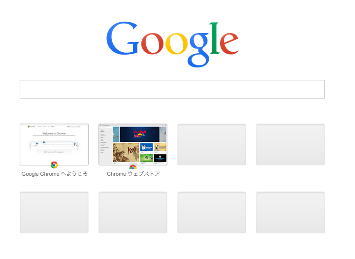
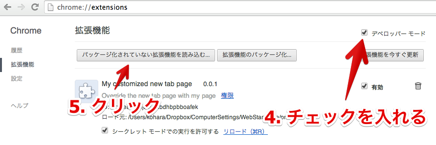

## 前置き

Google Chrome は新しいタブを開いた時にとあるページが表示されます。
検索ボックスがあるし最近良く使うページも表示されてそれなりに便利です。

しかしカスタマイズしたいと思うのがお年頃。
[Speed dial 2](http://speeddial2.com/) などのカスタマイズできる拡張はあるけれど、もっともっと深いところまでカスタマイズしたい、そう思うのは僕だけでしょうか？

色々な拡張を試しました。
どれも手軽に利用できて、カッコイイし、便利なんだけどもちょっとずつ不満がありました。
上記の Speed dial 2 が一番利用したかったんだけど、同期機能は有料なんですよねー。

そうだ、**自分で HTML 書けばいいじゃないか！** と思い至り、Dropbox + [New Tab Redirect!](https://chrome.google.com/webstore/detail/new-tab-redirect/icpgjfneehieebagbmdbhnlpiopdcmna) で同期できる自分好みのページに置き換えました。
しかしコレにも欠点が。
検索に利用するオムニボックス (上部の URL が表示されるところ) に余計な URL が残っちゃうんです。

じゃあ拡張にしちゃえと思って調べてみたら、思ったより簡単だったので、この記事です。
Google Chrome は拡張が書きやすい、デバッグがしやすいという点が大好きです。

## 機能

- Google Chrome の新規タブのページを自分で書いた HTML のページに置き換えられます
- オムニボックスに余計な URL は表示されません
- (Dropbox などを使えば同期できます)

## 方法

1. 自前で表示したいページ`index.html`というファイル名で作成します
2. 作ったファイルを適当なディレクトリにつっこみます (Dropbox なんかがおすすめ)
3. そのディレクトリ直下に下記のファイルを`manifest.json`というファイル名で保存します
4. Google Chrome の拡張機能のページ (chrome://extensions) からディベロッパーモードを選択
5. 「パッケージ化されていない拡張機能を読み込む」で作ったディレクトリを選択
6. 新規タブを開く

### manifest.json

    {
      "manifest_version": 2,
      "name": "My customized new tab page",
      "description": "Override the new tab page with my page",
      "version": "0.0.1",
      "chrome_url_overrides": {
        "newtab": "index.html"
      }
    }

### 説明画像

