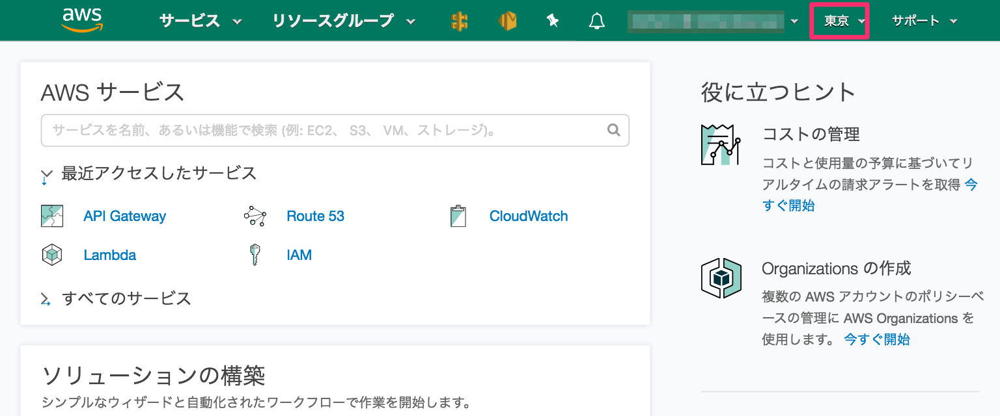
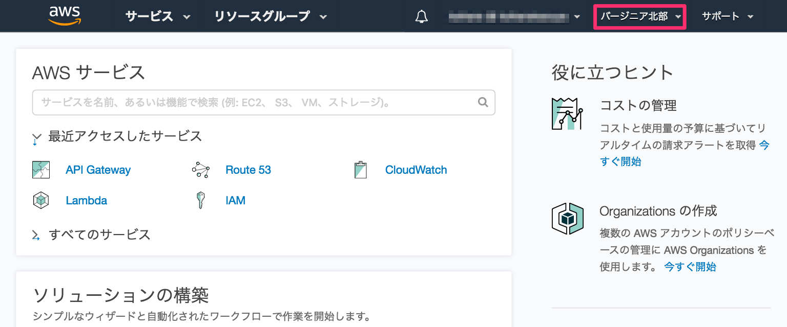
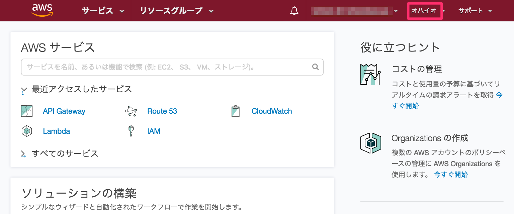

こんな感じ。

AWS マネージメントコンソールを触っている人なら必要性はわかってもらえると思う。

色はリージョン名から機械的に作った。
似た色になって異なるリージョンを区別しづらいのが難点だが、リージョンが増えたときに頭を悩ませるのもバカバカしいのでザックリ決めた。

インストールは [Stylish ページ](https://userstyles.org/styles/150583/aws-navbar-color-by-region) より。

[GitHub](https://github.com/KoharaKazuya/aws-navbar-color-by-region)
