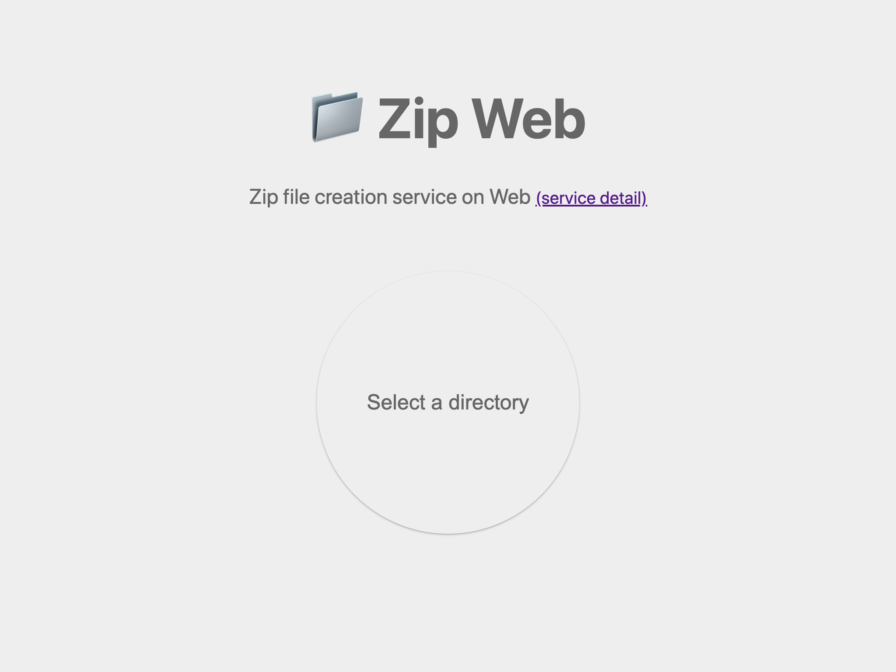

[][zipweb]

リンク: [https://zipweb.koharakazuya.net/][zipweb] (ソースコード: [GitHub][github])

## どのようなサービスか

ディレクトリから Zip ファイルを作る Web サービスです。
Windows や macOS でよくある問題を回避しつつ Zip ファイルを作ります。

「macOS は何に注意すればいいんだっけ？」と迷ったり、テストマシンにツールをインストールしたりすることなく、さっくり Zip が作れます。

具体的な機能としては、普通の Zip ファイルを作るのに加え、`Thumbs.db` や `.DS_Store` などの問題になりがちなファイルは含めないように除外します。また文字化けを避けるため Shift-JIS ではなく UTF-8 を使います。

ローカルだけで機能するのでサーバーなどに情報を送信することはありません。

---

ここから以降、技術的な話。

## 構成

一枚の HTML にいくつかのスクリプトを読み込ませて動かしている。Webpack こそ使っているが、ほぼ素の HTML + JS のみで動いている。

## 使っている技術

任意のディレクトリをアップロードさせるため、成果物の Zip ファイルをダウンロードさせるため [Browser-NativeFS][] の一部を使っている (詳細を後述)。

Zip ファイルの作成は仕様に従って最小限のものを実装した。最小限の Zip のファイルフォーマットは非常にわかりやすく、ほぼ格納するファイルごとに順番に詰めていくだけに近い。[Wikipedia](<https://ja.wikipedia.org/wiki/ZIP_(%E3%83%95%E3%82%A1%E3%82%A4%E3%83%AB%E3%83%95%E3%82%A9%E3%83%BC%E3%83%9E%E3%83%83%E3%83%88)>) を見ればほぼわかる。
JavaScript でバイナリを扱うのは Uint8Array, DataView などを愚直に使用するだけでよい。

余計なメタデータを含めない仕様としているが、これは単純に Zip ファイルフォーマットに従った実装が面倒だったので最小限にしているだけ。ファイルの変更日時やパーミッションを Zip ファイルに含めて利用することってあまり無い気がしたので省いた。

一般的に Zip 化すると同時に圧縮するというイメージあり、そのイメージ通りになるように圧縮もしている。
Deflate にかける必要があったので、Chrome に実装されていた [Compression Streams][] を使用した。全てのブラウザで使えるわけでは無いので、代替として [pako](https://github.com/nodeca/pako) を使用した。
Deflate という名前が厄介で、欲しいのは Deflate アルゴリズムの方だったが、Compression Streams の deflate という名前から得られるのは zlib 形式のデータになっている。つまり余計なヘッダーフッターがついている。これにハマり時間を使ってしまった。
(参考: [deflate と zlib と gzip の整理 - Qiita](https://qiita.com/ryskiwt/items/5ca10826252390a15d10))

Zip ファイルの作成処理が CPU ヘビーだろうと考えていたので、最初は Web Worker (Dedicated Worker) を使うつもりだったが、実装してみたところメインスレッドがブロックされる挙動にあまりならず問題なく使えたので対応していない。
アップロードするファイルのパターンによっては UI が固まるかもしれない。

## Native File System API と Browser-NativeFS

元々このサービスを作るきっかけになったのはこの記事を読んだことだった。

[Reading and writing files and directories with the browser-nativefs library](https://web.dev/browser-nativefs/)

面白そうな API がもうすぐ使えそうでその Ponyfill もあるなら使ってみたい、という動機だった。

Native File System API は WICG で議論されている、ユーザーデバイスのファイルやディレクトリを直接扱うための API だ (参考: [The Native File System API: simplifying access to local files](https://web.dev/native-file-system/))。Web でファイルを扱うためにアップロード＆ダウンロードではなく、好きなタイミングで特定ファイルを読み込んだり、上書きしたり、新しいファイルを作ったりすることができる。
これがもうすぐ (2020/10/6 の Chrome 86 から) 使えるようになる。WICG で議論されているだけのものなので Web 標準というわけではなく Chrome 以外のブラウザでは使えない。

Browser-NativeFS は Native File System API の Ponyll だ (参考: [polyfill と ponyfill の違い - ohbarye](https://scrapbox.io/ohbarye/polyfill%E3%81%A8ponyfill%E3%81%AE%E9%81%95%E3%81%84))。
Native File System API が使えない環境でも代替手段を提供してくれるとのことだったので使ってみる気になった。

Zip Web に組み込んで実際に使ってみたのだが、Zip に含めるファイルを読み込んでいる最中にエラーが発生して、その原因もわからず行き詰まってしまった。

https://twitter.com/KoharaKazuya/status/1307852501824147456

原因を探っているうちに、よくよく考えてみると Native File System API は別にこのサービスでは不要だったな、ということに気付いた。
Zip を作るというユースケースでは従来のアップロード＆ダウンロードという体験で十分だった。

そのため Browser-NativeFS の代替実装部分 (Browser-NativeFS 内では legacy として分類されている) のみを使うことにした。
Zip Web には Browser-NativeFS は全く必要ないのだが、従来の技術を使った実装例として参考にすることになった。

## Vercel

Zip Web のデプロイ先として [Vercel][] を使うことにした。
Vercel の利用は初めて。

フロントエンド中心のものをいくつか作っていると、毎回「手間はかけなくないけどいい感じにやってくれるホスティングサービス」が欲しくなる。
毎回作っている内容は違っても機能として欲しいのはただのファイルを配置したら公開してくれるサーバーなのでカスタマイズ要求は薄くあまり手間はかけたくない。一方でこだわりポイントは割とあって、CDN 通すとか HTTPS 必須とか SPA 対応ルーティングとか。要するにわがままを全部叶えた All in One なブラックボックスが欲しい。
選択肢はいろいろあって、今までは AWS Amplify Console を使っていたんだけど、Next.js 経由で Vercel に興味が出てたので使ってみた。

今回は求めてるものが少ない (静的ファイルのサーブのみ) ので、それに見合うだけの手軽さになっている点が良かった。調べることなく誘導されるままログインからぽちぽちするだけでデプロイが完了した。わかりやすいのはとても大事。

## まとめ

[Zip Web][zipweb] を作った。
Native File System API を使ってみたかったけど、Zip Web ではアップロード＆ダウンロードだけで十分で、その実装は [Browser-NativeFS][] を参考にした。
[Compression Streams][] も使っている。
Zip のファイルフォーマットは (最小限なら) 単純なので、素直に実装した。
デプロイ先に [Vercel][] を使った。わかりやすく手軽だった。

[zipweb]: https://zipweb.koharakazuya.net/
[github]: https://github.com/KoharaKazuya/zipweb/
[browser-nativefs]: https://github.com/GoogleChromeLabs/browser-nativefs
[compression streams]: https://wicg.github.io/compression/
[vercel]: https://vercel.com/
