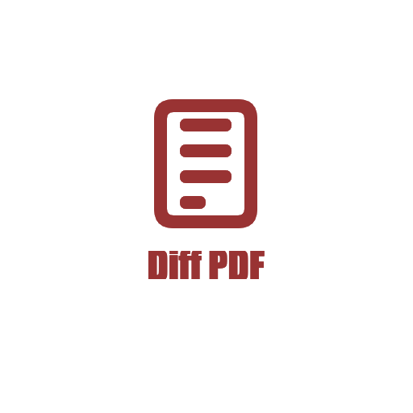

[][diff-pdf]

リンク: [https://diff-pdf.koharakazuya.net/][diff-pdf] (ソースコード: [GitHub][github])

## どのようなサービスか

さまざまな書類代わりに PDF を使っていて「以前のバージョンからの変更点が手軽にわかったらいいのに」と思ったことはありませんか？

[Diff PDF][diff-pdf] を使うと 2 つの PDF ファイルの違う部分が手軽にわかります。これを使って差がある部分を漏れなくチェックできるようにしましょう！

<iframe width="560" height="315" src="https://www.youtube.com/embed/gGlHdh26FYk" frameborder="0" allow="accelerometer; autoplay; clipboard-write; encrypted-media; gyroscope; picture-in-picture" allowfullscreen></iframe>

## これまでの改善の流れ

- v0.1.0 コアコンセプト実装 勤務先の同僚に向けて公開
- v0.2.0 最低限の UI 実装
- v0.3.0 履歴機能追加
- v0.4.0 実用レベルになるよう大幅修正
- v1.0.0 特に問題なさそうなのでインターネットに向けて公開 ← いまここ

## コア機能を実現するための仕組み

### Web で PDF ファイルを扱えるようにする - PDF.js

まず「Web で PDF ファイルを扱えるようにする」仕組みですが、これは [PDF.js](https://mozilla.github.io/pdf.js/) というライブラリを使用しています。
PDF.js は PDF ファイルを読み込み、描画するための **JavaScript の** ライブラリです。もう昔の話になってしまうのですが、PDF といえばブラウザのネイティブ拡張プラグインが必須という時代もあったため驚かれる方もいるかもしれませんが、Mozilla が開発し Firefox でも PDF の表示に使われているこのライブラリを使用すると、PDF ファイルを読み込み色々なことができます。

### PDF から画像データを抽出する - OffscreenCanvas

Diff PDF では PDF.js を用い、PDF ファイルをページごとの画像データに変換しています。
内部的に [canvas 要素](https://developer.mozilla.org/ja/docs/Web/HTML/Element/canvas) にレンダリングし、そこから [ImageData](https://developer.mozilla.org/ja/docs/Web/API/ImageData) を取得しています。
ちなみに以前までの実装では canvas 要素の代わりに [OffscreenCanvas API](https://developer.mozilla.org/ja/docs/Web/API/OffscreenCanvas) を使用していました。効率的なのですが、Chrome 以外に実装されていません。そのため以前まで Chrome のみのサポートにしていました (今はデスクトップの Chrome, Firefox, Safari, Edge に対応しています)。

### 2 つの画像データの差分を強調表示する - pixelmatch

ページごとの ImageData に変換できたら、次は画像として比較し差分を検出する必要があります。
これには Mapbox 製の [pixelmatch](https://github.com/mapbox/pixelmatch) というライブラリを使用しています。このライブラリはその名の通り、ピクセルレベルで画像を比較してくれます。差分画像として差分がある部分を赤く強調表示するのも、このライブラリがやってくれます。

### ページの追加、削除に対応する

ただし、愚直にページ単位で 1 枚ずつ画像を比較すれば完成というわけにはいきません。
例えば片方の PDF ファイルの中程に 1 ページだけ新しいページが追加されていた場合、差分はどのように表示されるでしょうか？ 愚直に先頭から比較していくと、追加されたページ以降が全て差があるとして検出されてしまいます。

```
// P2 以降が「差分あり」といて検出されてしまう
P1 <- 差分なし -> P1
P2 <- 差分あり -> P1' (追加ページ)
P3 <- 差分あり -> P2
P4 <- 差分あり -> P3
                  P4

// できればこちらのような検出が望ましい
P1 <- 差分なし -> P1
                  P1' (追加ページ)
P2 <- 差分なし -> P2
P3 <- 差分なし -> P3
P4 <- 差分なし -> P4
```

差分を検出するためには工夫が必要でした。
そこで既存のよく知られているテキスト差分検出アルゴリズム、Git の diff や diff コマンドなどのアルゴリズムを流用しようと思い、一通り調べてみましたが思いの外難しく、簡単には使えなさそうだったので早々に諦めました。

そのため Diff PDF では独自のゴリ押しのアルゴリズムが実装されています。
ページ位置が近い画像同士の全ての組み合わせで比較を実行してしまって、その際に pixelmatch から「一致しなかったピクセル数」が取得できるのでそれをスコアとして、全ての組み合わせの中から一番スコアの高かった (= 一番似ていた) ペアを選出する、という仕組みです。
考えられる候補を実際に比較してその中から良い候補を選ぶ、というザ・ゴリ押しな実装となっています。

### バックグラウンドスレッドにオフロードする - Web Worker

なお、pixelmatch の処理は容易に CPU ヘビーなものになりそうという想像ができるので、[Web Worker (Dedicated Worker)](https://developer.mozilla.org/ja/docs/Web/API/Web_Workers_API/Using_web_workers#Dedicated_workers) にオフロードしています。
それにより、JavaScript で実行しているにも関わらず UI が固まってしまわないことが実現できています。PDF.js もライブラリ内で Web Worker に処理を任せているようです。

## 実用的なサービスにするための Extra な機能

### リッチな UI 開発基盤を整える - React, Next.js, Vercel

ある程度複雑な UI 機能を持たせたいため、開発基盤として React, Next.js, Vercel の組み合わせを採用しました。
PDF を扱う都合上デスクトップ環境の想定で、JavaScript のサイズをキリキリ詰めてもあまり意味がないため、慣れていて使いやすく「ハズレ」になりにくいこの組み合わせを選びました。

### PDF ファイルデータを履歴として保存する - IndexedDB

Diff PDF は PDF ファイルの更新があったときに変更された箇所を見つけることを容易にする、というユースケースを想定して実装しています。そのため以前に使用した PDF を元ファイルなしに呼び出せると嬉しいです。そこで履歴機能を実装することにしました。

ただし、プライバシー保護の観点から PDF ファイルをサーバーにアップロードするわけにはいきません。PDF Diff ではブラウザに保存するようにしました。ファイルなどのデータを保存するには [IndexedDB](https://developer.mozilla.org/ja/docs/Web/API/IndexedDB_API) が適しています。

IndexedDB は直接扱うには難しいとされており、通常 [localForage](https://github.com/localForage/localForage) や [KV Storage](https://wicg.github.io/kv-storage/) などの API を簡単にするライブラリの使用が推奨されます。
しかし PDF Diff は趣味のプロダクトということもあって、勉強がてらに直接扱うことにしました。確かに少し難しいと感じましたが [MDN のガイド](https://developer.mozilla.org/ja/docs/Web/API/IndexedDB_API) に一通り目を通すと問題なく扱うことができました。[idb](https://www.npmjs.com/package/idb) という IndexedDB の API を Promise 化する薄いラッパーライブラリは使用しています。

#### プラベートブラウジング環境での IndexedDB の注意点

なお、プライベートブラウジング中は IndexedDB の使用が拒否される、というブラウザ機能があるようで、その点で苦労しました。一瞬見てみぬふりをしようとも思ったのですが、Playwright の Safari はどうやらプライベートブラウジングモードのようで、テストを実行したい場合は対応が必要でした。
単純に IndexedDB の使用を名前空間のアクセス時にエラーになるのであれば、プライベートブラウジング環境の検知が楽だったのですが、Firefox では実際のデータ保存時まではエラーにならない、Safari に関しては Blob データ保存時にエラーになる、みたいな妙な挙動をしていました。
謎の挙動ですが、ページ読み込み時にそれを検知して、プライベートブラウジング環境では IndexedDB の代わりのメモリストレージに差し替えるようにしました。

### UI ライブラリで見た目を整え、アクセシビリティを改善する - React Spectrum

私は UI デザインの知識を持ち合わせていませんが、ある程度見た目はダサくない程度に整えたいと思いました。
そこで UI コンポーネントライブラリとして Adobe 製の [React Spectrum](https://react-spectrum.adobe.com/) を使用しました。このライブラリにはアクセシビリティについてよく考えられ、かつ使用しやすい UI コンポーネントが多数内容されています。React 環境下において ベター HTML 要素のように使えるライブラリかと思います。

使用した感想としてはコンポーネントの API がよく考えられおり開発者にとって使いやすく、リッチでアクセシブルでエンドユーザーにとっても使いやすい良いライブラリだと感じました。
一方で React StrictMode で警告が出る実装になっている、Next.js と組み合わせるにはハックが必要、JS/CSS アセットサイズが結構増える、各コンポーネントの CPU 負荷は無視できない程度にはある、という弱点も感じました。

## 開発しやすくする

### テスト基盤を整える - Playwright

最近、私はテスト基盤として [Puppeteer](https://pptr.dev/), [Cypress](https://www.cypress.io/), [Playwright](https://playwright.dev/) に注目しています。これらのツールの比較は [Puppeteer, Selenium, Playwright, Cypress - how to choose? - Fast authoring of AI-based, self-healing, cross-browser tests—codeless, coded, or both](https://www.testim.io/blog/puppeteer-selenium-playwright-cypress-how-to-choose/) という記事でわかりやすく説明されています。
Diff PDF ではこの中で触ったことがなかった Playwright を使用して E2E テストを書きました。

Playwright は Puppeteer と同じく、「ブラウザを自動操作する」ことのみに責務を持つライブラリです。その点 Cypress の「E2E テストフレームワーク」とは方針が異なるものです。
そこから現れる Playwright の良さは Jest のような他のライブラリと組み合わせやすい、さまざまな目的のために応用が効きやすい、などです。
Puppeteer と比べると、Safari のサポート、Auto-waiting の機能によりテストを楽に安定したものが書けるという良さがあります (昔の Puppeteer と比べてます。今は変わってるかも)。Auto-waiting 相当は Cypress にもあります。正直これがないとまともにテストコードが書けません。クリックひとつにも待機処理を書かないと行けなくなるので……。

Playwright を使用して Diff PDF のいくつかの E2E テストを書きました。
テストが安定しないところがあったり、デバッグが難しかったり、大変な部分が多かったですがブラウザ操作自体、状態の塊である Web ページを対象にするために茨の道なのでしょう。大変でしたが、満足しています。
今後は Cypress より優先して選択すると思います。

### 状態管理に React Context を使う - constate

グローバルな状態の管理のために [constate](https://github.com/diegohaz/constate) を使用しました。
README に書かれている API と非常に短い実装をぜひ見てみてください。

これまでは React や Preact とは Redux を組み合わせて使うことが多かったのですが、Next.js の SSR と Redux が相性が悪そう (セットアップが大変そう) という点と、React の Concurrent Mode や Server Components などを意識すると、より React の方向性に沿った方が腐りにくいのかな、と考え直すきっかけがあったため新しくライブラリを試してみることにしました。

(私の理解が正しければ、) **状態を細かく分割した条件のもとでは** 再レンダリングの非効率さの懸念も大きくはないはずです。一つの状態にまとめてしまうともちろん非効率ですが……。
ただし useSelector 相当の機能が簡単には手に入らないのでそういった機能がほしくなる、つまり多数のエンティティなどの管理したい、などがある場合は素直に React Redux などを使う方がいいかと思います。

### 非同期処理をうまく扱う - react-async-hook

Web フロントエンドの実装では非同期処理 ≒ HTTP を扱うことなので [SWR](https://swr.vercel.app/) などがあれば十分、という場合もあると思います。
今回は IndexedDB や Web Worker を使う関係から一般の非同期処理を React 上で手間なく使えるようにしたかったので選びました。[React-async-hook](https://github.com/slorber/react-async-hook) は単純そうな API の裏にいろんな問題への対処が隠れているのが面白いです。ぜひ [README のリンク先の記事](https://sebastienlorber.com/handling-api-request-race-conditions-in-react) を読んでみてほしいです。

## まとめ

PDF の差分を表示するツール [Diff PDF][diff-pdf] を作ったので紹介しました。
また、Diff PDF が PDF.js、OffscreenCanvas、pixelmatch、Web Worker などで動いていることを説明しました。

最後まで読んでいただきありがとうございました。ぜひ [Diff PDF][diff-pdf] を使ってみてください。

[diff-pdf]: https://diff-pdf.koharakazuya.net/
[github]: https://github.com/KoharaKazuya/diff-pdf/
